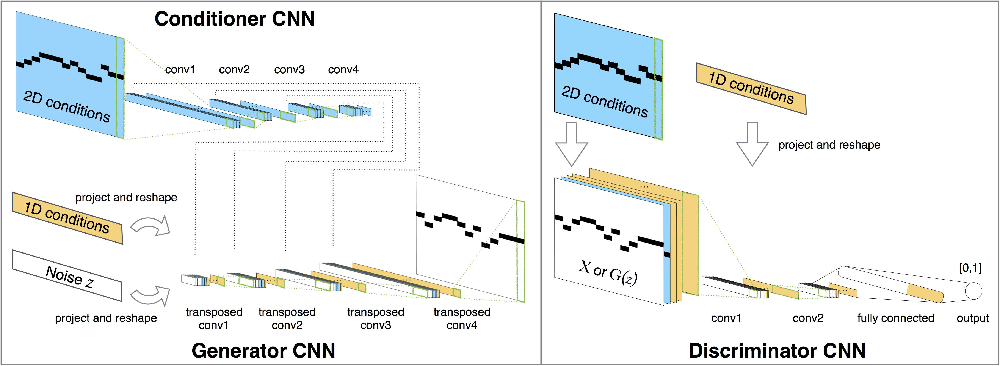

Este repositorio contiene una adaptación del modelo presentado en [MdidNet : A Convolutional Generative Adversarial Network for Symbolic-domain Music Generation](https://arxiv.org/abs/1703.10847).

MidiNet vanilla: (https://github.com/annahung31/MidiNet-by-pytorch).

## Acknowledgment

Este script está adaptado de: [A tensorflow implementation of "Deep Convolutional Generative Adversarial Networks](https://github.com/carpedm20/DCGAN-tensorflow)

## Requisitos
[Tensorflow 1.12](https://github.com/tensorflow/tensorflow/tree/r0.12)
